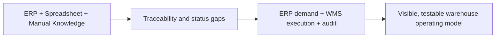

# BA Case Study — Lightweight Multi-Warehouse WMS Prototype

## Business Problem

Overseas warehouse execution relies on ERP documents, spreadsheets, manual SN tracking and operator knowledge of physical locations. The core problem is not simply “missing software”; it is the absence of one agreed operating model connecting ERP demand, physical warehouse actions, inventory condition, serial identity, preparation, pickup and exception handling.

This prototype tests a target-state process and the business rules required to make that process trustworthy.

## Current-State Pain Points

- ERP warehouse categories and physical locations can be treated as if they are the same concept.
- Spreadsheet `Prepared` can mean demand, source allocation or completed physical preparation.
- Current stock, serial identity and location evidence can disagree.
- Batch SN work is slow when operators must select SKU manually.
- Uploading a file can be confused with confirming a physical operation.
- Repair, replacement outbound and transfer flows have different evidence gaps.
- ERP failure can be mistaken for warehouse-operation failure.
- Management reporting can use the wrong date or SN count as quantity authority.

## Stakeholders

| Stakeholder | Need |
| --- | --- |
| Warehouse Operator | Fast scanner-first execution and clear errors |
| Warehouse Coordinator | To Prepare, Awaiting Pickup and exception visibility |
| Repair Team | Faulty receipt and complete repair lifecycle |
| Operations Manager | Reliable current stock and workflow status |
| ERP / Finance | Controlled responsibility boundary and write-back evidence |
| IT / Development | Maintainable domain model, integration boundary and deployment safety |
| Management Stakeholders | Demonstrable target state and known limitations |

## Requirements

### Functional

- Import replacement demand through an ERP boundary.
- Allocate exact physical stock before preparation.
- Freeze Prepared inventory without reducing Physical Qty.
- Support scanner, paste, CSV and XLSX intake in one outbound review batch.
- Revalidate before any inventory mutation.
- Preserve condition and SN identity through outbound, repair and transfer.
- Provide current inventory reporting by SKU/model, warehouse, condition and location.
- Visualise the warehouse in a floor plan and rack elevation.
- Generate read-only pickup and unit labels.
- Record audit and exception evidence for important state changes.
- Present major workflows in English and Simplified Chinese.

### Non-functional

- Inventory correctness over convenience.
- Atomic database transactions for physical operations.
- Application-enforced append-only historical transaction evidence.
- Bounded APIs and set-based SN lookup.
- Same-region Preview compute and database.
- Workstation-first and tablet-usable UX.
- Explicit non-production and ERP-adapter status.
- Safe deployment with migration separated from seed/reset.

## Business Rules

1. `Available = Physical - Frozen`.
2. Preparation increases Frozen and leaves Physical unchanged.
3. Dispatch reduces Physical, releases Frozen and sends the SN Outbound.
4. Move is same-warehouse and atomic; Transfer is cross-warehouse.
5. Product outbound requires all required SN before dispatch.
6. `New`, `Repair_Good`, `Repair`, `Scrap` and `Material` remain distinct.
7. InventoryBalance, not SN count, is current quantity authority.
8. Serial registration never increases inventory.
9. Actual outbound reporting uses `outboundAt`.
10. Printing never changes inventory.
11. ERP write-back failure never silently reverses confirmed physical work.
12. Unknown SKU, SN or location is not guessed.

## Current vs Target Process

| Current-state pattern | Target-state design |
| --- | --- |
| ERP documents manually interpreted in spreadsheets | ERP demand enters a controlled import preview |
| Prepared meaning is overloaded | Pending Allocation, Allocated and Prepared are distinct |
| SN lists mutate through manual handling | SN intake becomes a review draft before confirmation |
| Location knowledge sits with individuals | Physical locations are relational and spatially searchable |
| Errors are spreadsheet notes | Exceptions have status, severity and references |
| ERP failure can block/erase warehouse evidence | Physical commit survives; ERP retry is separate |
| Stock totals can be inferred from SN rows | InventoryBalance is quantity authority |

## Data Requirements

- Stable SKU, model, item type, reporting eligibility and SN policy.
- Separate ERP warehouse classification and physical warehouse/location.
- Balance grain by warehouse, location, optional container, optional product, item type and condition.
- First-class SN identity with warehouse, location, condition and lifecycle status.
- Lifecycle timestamps for import, allocation, preparation, pickup readiness, dispatch, transfer and repair.
- Operational ledger transactions with operation ID, actor, business reference, quantity deltas and effective time; application workflows correct history with compensating entries.
- Explicit legacy traceability-gap classification.

Spreadsheet columns are mapped by semantic header. Display-only occupancy placeholders and formula/helper fields are not inventory concepts.

## Integration Requirements

- All ERP access remains behind `ERPAdapter`.
- Replacement outbound uses Replacement Unit Information.
- The browser does not contain Kingdee-specific logic or credentials.
- External calls use idempotency and durable sync jobs.
- Real ERP misses become visible exceptions or Manual Review.
- Internal Preview may use Mock ERP, but the UI must identify it.
- Production Kingdee behavior cannot be claimed until contract and credentials are verified.

## Exception Scenarios

- SN not found or already allocated.
- SN belongs to another SKU, condition, warehouse or location.
- Physical stock is insufficient after Frozen is considered.
- Prepared demand has no physical source.
- ERP record is missing or integration is unconfigured.
- Repair receipt duplicates an active repair.
- Transfer scan is incomplete or includes an invalid unit.
- Reconciliation identifies wrong quantity, location, condition or status.
- Legacy data lacks complete SN evidence.
- ERP write-back fails after physical confirmation.

Each scenario requires an operator-readable message and must avoid silent data correction.

## UX Decisions

- High-information-density tables suit workstation operations.
- Scanner-first inputs submit on Enter, reject rapid duplicates and restore focus.
- Scan/paste/upload feeds one review workbench.
- Review drafts have no stock effect.
- Operators correct exceptions before confirmation.
- Internal states are translated into operational terms such as `To Prepare / 待备货` and `Awaiting Pickup / 待提货`.
- Warehouse search highlights the location spatially.
- Condition and quantity remain visible during execution.
- The UI visibly states `INTERNAL PREVIEW · NON-PRODUCTION`.

## Prototype Validation

Validation used the existing Sydney prototype dataset and the validated workbook as business evidence. The prototype has demonstrated:

- current stock and Product Inventory Report from database-backed balances;
- outbound demand, allocation, preparation/Frozen logic and review-before-mutation;
- serial lookup and lifecycle presentation;
- faulty receipt and native repair lifecycle;
- transfer out/in with preserved condition;
- SVG floor plan, rack elevation and location detail;
- bilingual major workflows;
- environment guards, migrations, automated tests and Vercel Preview deployment.

Validation does not claim production Kingdee integration, enterprise security or formal warehouse UAT.

## Outcomes

- A coherent target-state operating model is visible and discussable.
- Core inventory rules are expressed in code, tests and documentation.
- ERP and WMS responsibilities are separated.
- Quantity, SN identity and location evidence have distinct authority.
- Warehouse exceptions are first-class work.
- The prototype can support structured stakeholder feedback instead of abstract requirements discussion.

## Implementation Trade-offs

- A modular monolith keeps one deployable system and one inventory transaction boundary; microservices would add coordination cost without current scale evidence.
- Review batches remain temporary browser drafts because they have no inventory effect; production recovery of unfinished operator drafts would require an approved persistence and ownership policy.
- `InventoryBalance` supports fast current-state reads while `StockTransaction` provides application-level append-only reconciliation evidence.
- React + SVG communicates warehouse structure without introducing a 3D engine; the geometry is intentionally operational, not surveyed-to-scale.
- The Preview persists ERP sync-job evidence after physical confirmation, but it does not claim a production worker, retry scheduler or verified Kingdee write-back.
- Prototype authentication keeps the internal demo focused on process and business rules; enterprise SSO, RBAC enforcement and security assurance remain explicit future requirements.

## Open Questions

- Which Kingdee endpoints and data contracts are approved?
- Which roles can approve adjustments, stocktake variance and repair outcomes?
- What are the authoritative Product and Location masters at cutover?
- Which legacy SN gaps are acceptable at go-live?
- What backup, audit-retention and availability targets are required?
- Which warehouse devices, scanners and label printers require formal compatibility testing?
- What UAT evidence is required from warehouse, finance and IT?

## Recommended Next Steps

1. Run the internal demo and collect workflow-specific feedback.
2. Convert feedback into prioritised requirements and acceptance criteria.
3. Confirm Product, Location and ERP warehouse mappings.
4. Validate the real Kingdee contract in a controlled non-production environment.
5. Define SSO/RBAC, security, monitoring and backup requirements.
6. Establish dedicated Dev/UAT/Production data environments.
7. Conduct formal UAT and a rehearsed migration/cutover before any production claim.

The recommended positioning is:

> This is a working WMS prototype based on observed warehouse workflows. The focus is process analysis, requirements, inventory and SN business rules, ERP/WMS boundaries, exception handling and target-state system design.

It should not be positioned as a complete replacement production WMS.

## System Automation

The target operating model is one data input where possible, automatic matching where reliable, and operator attention only for physical confirmation or exceptions. The implemented Preview demonstrates:

- ERP task creation behind `ERPAdapter`;
- batch Pickup Code label generation and one print/PDF workflow;
- set-based SN lookup and SKU/model matching;
- original SH lookup for faulty returns, with ERP fallback;
- batch validation for faulty returns and expected inbound datasets;
- controlled workflow transitions and audit records;
- one-document cross-warehouse transfer linkage;
- durable ERP sync jobs after physical commit; and
- consistent weekly/monthly operational KPI calculations.

Notification event names are a target integration boundary, but the Preview does not pretend to send email or Teams messages.

## Human Control

The warehouse operator still confirms what software cannot safely infer:

- goods are physically present at receipt;
- the correct stock was physically picked;
- prepared stock is placed in the selected staging/dispatch location;
- unresolved or conflicting SN rows are corrected or excluded;
- damaged and incorrect goods are judged by a person;
- destination staff confirm transfer receipt;
- dispatch staff confirm the final physical handover; and
- supervisors approve exceptional stock adjustments.

This separation reduces repetitive administration without allowing expected data or an external timeout to overwrite warehouse reality.
