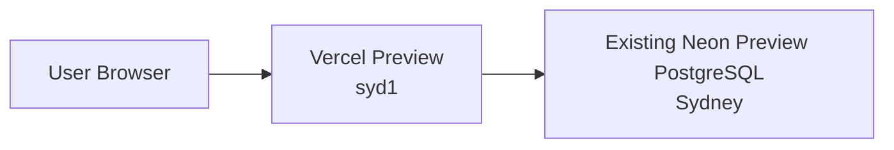
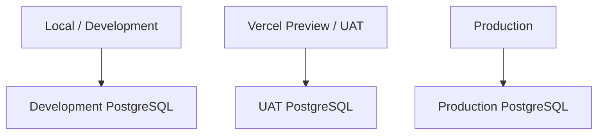

# Database and Environments

## Current Decision

The current Neon Sydney database remains the **Internal Preview / Prototype Database** and must not be reused as Production. Production uses a separately scoped PostgreSQL database and the same Prisma-backed application runtime.

It is reused because it:

- contains the validated Sydney prototype dataset;
- already supports the major demonstration workflows;
- avoids duplicate Opening inventory and repeated seeding;
- avoids unnecessary migration, reconciliation and environment maintenance;
- is suitable for stakeholder demonstration and BA validation.

No new PostgreSQL database is required for this internal Preview release. This decision does not designate the database as production.

## Current Preview Architecture



The Vercel Preview application uses:

```text
APP_ENV=preview
DATABASE_ENV=preview
NEXT_PUBLIC_APP_ENV=preview
```

The runtime guard rejects a Preview or staging application connected to database metadata classified as production.

## Environment Roles

### Local Development

Purpose: developer work, automated tests and controlled fixtures.

May use:

- local or development PostgreSQL;
- Mock ERP;
- explicit development fixtures;
- manual `pnpm db:seed` only against an intended disposable database.

### Internal Preview

Purpose: stakeholder demonstration, business-process validation and warehouse feedback.

Uses:

- the existing Neon Sydney prototype database;
- Vercel Preview functions configured for `syd1`;
- current Sydney prototype data;
- Mock or explicitly Unconfigured ERP when real ERP is unavailable;
- read-only or controlled integration simulation.

The UI clearly identifies this environment as non-production.

### Production Cutover Target

Production database wiring and the guarded Sydney opening-import tooling are implemented. The live cutover is currently blocked by the critical authoritative-source reconciliation items recorded in `docs/SYDNEY_PRODUCTION_CUTOVER.md`. Production ERP remains `mock` for this release as explicitly scoped; this must be visible operationally and must not be described as a live Kingdee integration.

A dedicated production database, backups/recovery, formal access provisioning, monitoring, security review and business sign-off remain deployment prerequisites.

## Migration and Seed Policy

Normal Vercel deployment runs:

```text
prisma generate
prisma migrate deploy
next build
```

Migration changes schema. Seed creates data. They are separate operational decisions.

Normal deployment must never:

- reset the schema;
- run the demo seed;
- replace current inventory;
- duplicate Opening balances;
- delete migrated Sydney stock.

`pnpm db:bootstrap-preview` is retained only as an explicit manual operation for a completely empty, approved non-production database. It is not part of `vercel-build`. The existing populated Preview database must not use it.

`SHADOW_SEED` is also explicit, non-production and checksum-idempotent. It is not an automatic deployment step. Controlled replacement is disabled for the internal release unless a separate approved recovery procedure requires it.

## Current Data Safety

The workbook is read-only business evidence. The application and development scripts never modify `reference/SYD_WMS_current_reference.xlsx`.

Inventory quantity authority is `InventoryBalance`; the transaction ledger is reconciliation evidence. Spreadsheet display placeholders are excluded. Existing Opening inventory is never recreated during deployment.

Before each Preview release:

1. confirm connectivity;
2. run `prisma validate`;
3. check migration status using `prisma migrate status`;
4. perform read-only counts for warehouses, products, locations, balances and outbound orders;
5. verify non-zero current stock;
6. smoke-test bounded read APIs;
7. do not mutate data solely for validation.

## Environment Variables

Required categories for Preview are:

- `DATABASE_URL` for pooled application access;
- `DATABASE_URL_UNPOOLED` for migrations where configured;
- `APP_ENV`, `DATABASE_ENV` and `NEXT_PUBLIC_APP_ENV`;
- `ERP_ADAPTER`;
- Kingdee settings only when an approved gateway and credentials exist.

Safety controls such as `DEMO_MODE`, shadow import and replacement flags should be false for the populated internal Preview. Secret values must not appear in logs, documentation or Git.

## Current Limitations

- Prototype data and legacy traceability gaps remain present.
- There is no production SLA or production backup policy.
- Restore testing and point-in-time recovery evidence are not part of this release.
- Authentication and data-access controls are prototype-level.
- The database must not be assumed to contain official financial inventory.

## Target Database Architecture

When the product advances beyond internal Preview:



Credentials, environment metadata and data lifecycles must be isolated. A Preview deployment must never connect to the production database.

## Controlled Migration and Cutover

The Preview database must not be copied blindly into production. The controlled migration must:

1. freeze Product Master mapping;
2. freeze Location Master;
3. define the cutover timestamp;
4. export authoritative current stock;
5. reconcile ERP and physical stock;
6. import Opening inventory once;
7. import known SN identities;
8. classify legacy SN gaps;
9. validate Physical totals and locations;
10. activate the production WMS after sign-off;
11. prevent duplicate Opening entries.

Future production also requires automated backups, point-in-time recovery where supported, restore testing, retention policy and migration rollback procedures.
