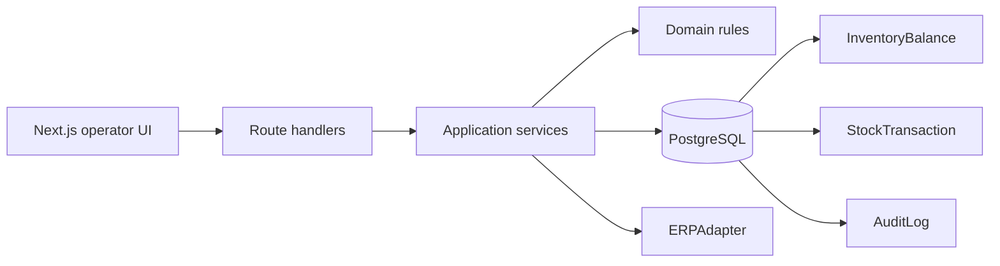

# IT Handoff

## 1. Project positioning

This repository is a working warehouse-operations prototype, a target-state validation tool, and an ICT business-analysis/process-optimisation showcase. It is not yet a production WMS and does not claim completed Kingdee integration.

## 2. Technology stack

- Next.js 16 App Router, React 19 and TypeScript.
- PostgreSQL on the dedicated Preview Neon database.
- Prisma 7 with additive SQL migrations.
- Vitest for domain and service tests; ESLint and TypeScript for static checks.
- Vercel Preview deployment in `syd1` with mandatory environment metadata.

## 3. Architecture

The application is a modular monolith. React components handle presentation only. API routes validate transport input and call server services. Domain modules hold pure rules. Prisma repositories and controlled balance updates persist inventory, immutable ledger evidence and audit records. External ERP behavior is isolated behind `ERPAdapter`.



## 4. Domain modules

- Inventory balances and immutable stock ledger.
- Outbound import, allocation, preparation/freeze and dispatch.
- Scanner review batches for outbound, inbound, faulty receiving and Transfer.
- Serial identity, registration, lifecycle and reconciliation.
- Same-warehouse Move, Adjustment and cross-warehouse Transfer.
- Faulty receiving, RepairJob lifecycle and Repair outcomes.
- Product inventory, operational reporting, warehouse map and labels.

## 5. Inventory authority

`InventoryBalance` is current quantity authority. Every controlled mutation also appends `StockTransaction` evidence and an `AuditLog`. The ledger is the reconciliation source; historical rows are never edited to correct an error. Historical report values are reconstructed only when an Opening baseline exists. Otherwise the metric is unavailable with reason `HISTORICAL_BASELINE_INSUFFICIENT`.

## 6. SN traceability model

`SerialNumber` is a first-class relational entity linked to Product, Warehouse, Location and operational allocations. Registration binds identity to already-existing Physical Qty and never increases inventory. Physically present status and allocatable status are separate policies. Transfer preserves the same SN identity and condition from source through In Transit to destination receipt.

## 7. Review-before-mutation principle

Scanning, paste and CSV/XLSX upload create a temporary browser review batch only. Validation resolves identity and exposes invalid, duplicate or unresolved rows. No inventory changes until an explicit confirm endpoint revalidates the full selected set in the server transaction.

## 8. ERPAdapter boundary

All ERP access belongs behind `ERPAdapter`. Preview uses `MockERPAdapter`; it does not prove Kingdee connectivity. Production integration requires an approved Kingdee contract, credentials, retry policy and test environment. A confirmed physical operation is not silently undone by later ERP write-back failure.

## 9. Database and environment rules

- Preview/staging must never connect to a production database.
- `DATABASE_ENV` and Vercel environment metadata are mandatory.
- Demo fixture execution requires `ALLOW_DEMO_FIXTURE=true` and refuses Production.
- Never reset or reseed a populated Preview during normal development or deployment.
- Shadow workbook import is explicit, server-side, checksum-idempotent and never automatic in Production.

## 10. Migration approach

Use forward-only, additive Prisma migrations. Resolve current schema and data shape before writing a migration. Do not rewrite historical stock rows. Backfills must have an authoritative source; unknown warehouse, SKU, SN, condition or location remains unknown. Run `prisma migrate deploy` during controlled deployment, never `prisma migrate reset` against populated environments.

## 11. Test commands

```text
pnpm test
pnpm typecheck
pnpm lint
pnpm build
pnpm i18n:check
```

Transfer lifecycle tests use isolated in-memory/fake data and never connect to Preview. Browser smoke testing remains read-only unless a separately approved demo operation is being rehearsed.

## 12. Known limitations

- Historical inventory is unavailable before a reliable Opening ledger baseline.
- Warehouse area productivity is unavailable until approved floor-area master data is configured.
- Legacy exceptions without warehouse ownership are excluded from scoped totals.
- Preview ERP adapter is Mock; Kingdee production connectivity is not validated.
- Transfer receipt is all-or-nothing; partial receipt policy is not implemented.
- Temporary review batches live in browser storage and are not durable operational records before confirmation.
- Application-level role navigation exists, but production-grade API authorization is incomplete.

## 13. Prioritised backlog

### P0

- Remove or lock the legacy reset command before any production cutover.
- Complete authoritative database/environment isolation and production access controls.
- Approve and validate the real ERP integration contract.

### P1

- Production-grade API authorization and SSO design.
- Controlled partial Transfer receipt policy, if required operationally.
- Master-data governance for warehouse area and location capacity.
- Operational recovery runbooks for failed ERP write-back and reconciliation exceptions.

### P2

- Durable review-batch persistence if cross-device handoff is required.
- Notification delivery channels and operational dashboards based on approved events.
- Additional performance and accessibility validation at production data volumes.

## 14. Production-readiness gaps

The prototype needs security review, privacy/data-classification review, production monitoring, backup/restore validation, disaster recovery, load testing, migration rehearsal, support ownership, runbooks, Kingdee certification and formal UAT before production use.

## 15. Safe continuation guide

1. Read `AGENTS.md`, `docs/BUSINESS_RULES.md` and `docs/ASSUMPTIONS.md` before inventory work.
2. Add or update a failing domain/service test before changing a business rule.
3. Keep business logic out of React components and ERP specifics out of domain services.
4. Preserve immutable history; post a correcting transaction and audit entry.
5. Run all quality commands and a read-only Preview smoke test.
6. Never run destructive commands against populated Preview without explicit approval and an exact target review.

## Preview-only Transfer rehearsal

`DEMO-TRANSFER-001` uses four dedicated `DEMO-TRANSFER-*` SNs in SYD at `DEMO-TRANSFER-OUT`, destined for MEL. The installer is explicit and idempotent, never part of seed or deploy, and does not create, dispatch or receive a Transfer automatically. The intended demo is scan/paste, validate, show Product + Condition grouping, then—only during the approved rehearsal—confirm one Transfer ID and explain In Transit and destination receipt.

Cleanup is deliberately non-destructive: do not delete ledger, audit, Transfer or SN rows and do not reset the fixture. Complete receipt against the same Transfer ID if the demonstration is confirmed. For another destructive rehearsal, create a new numbered fixture after review rather than rewinding history.
