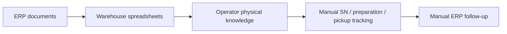
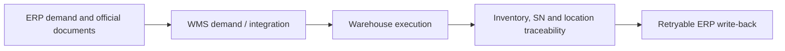
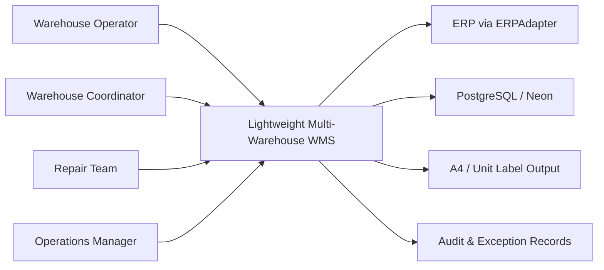
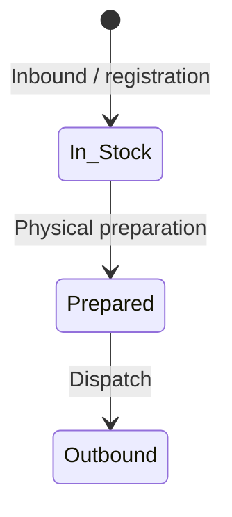
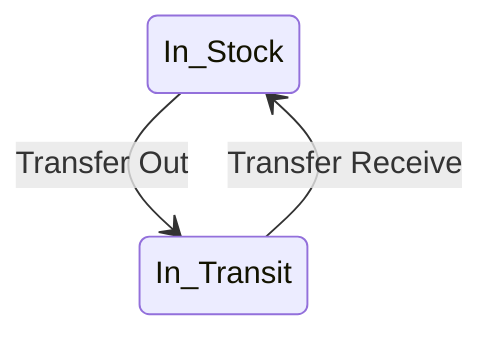
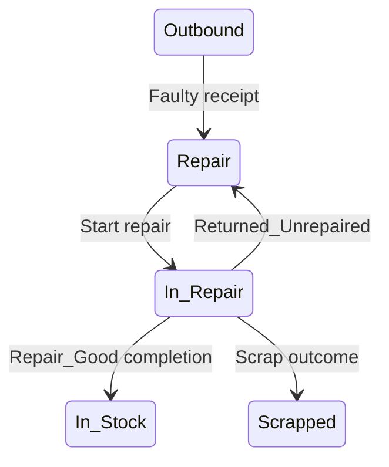
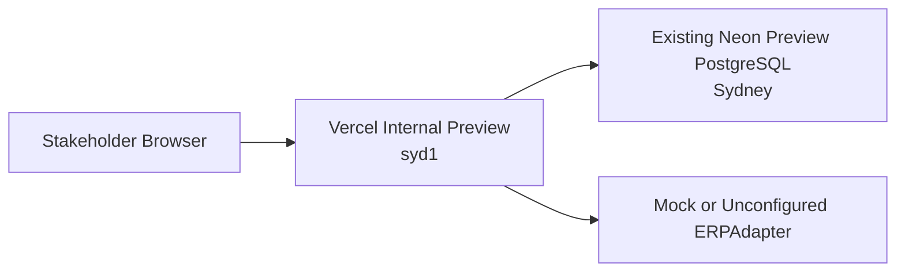

# Internal Preview Release — WMS Prototype Architecture, UX & Deployment Handoff

## 1. Executive Summary

This repository is a working internal WMS prototype based on observed Sydney warehouse workflows. It demonstrates business-process analysis, requirements definition, inventory and serial-number rules, ERP/WMS boundaries, exception handling, warehouse UX, integration design and a deployable modular-monolith architecture.

It is not presented as production-ready enterprise software. The current release is intended for warehouse and management demonstrations, business validation and target-state discussion.

## 2. Problem Statement

The current operating model depends on ERP documents, spreadsheets, manual serial-number tracking, operator knowledge of physical locations and disconnected preparation, pickup, repair and transfer processes. This creates four recurring risks:

- financial and physical inventory concepts can be confused;
- serial identity and physical location can become incomplete;
- preparation and pickup status can be interpreted inconsistently;
- errors can disappear into spreadsheets instead of becoming controlled exceptions.

## 3. Current-State Process



The spreadsheet remains important operational evidence, but formulas, helper columns, display placeholders and concatenated keys are not suitable as the long-term transaction architecture.

## 4. Target-State Process



The target state separates official ERP responsibility from physical warehouse execution while preserving a clear audit trail between them.

## 5. System Context



The browser never connects directly to PostgreSQL or a vendor ERP API. Server APIs and application services enforce the domain rules.

## 6. ERP / WMS Ownership

| ERP owns | WMS owns |
| --- | --- |
| Official sales, service and transfer documents | Physical warehouse and location |
| Financial inventory and posting | Containers and serial execution state |
| Official ERP warehouse classification | Physical preparation and Frozen reservation |
| Customer/service master records | Pickup, dispatch and warehouse transfers |
| Final ERP posting state | Faulty return, repair and stocktake |
| Financial controls | Adjustments, operational exceptions and audit trail |

ERP warehouse classification is never treated as a physical WMS location. Confirmed physical operations remain valid if ERP write-back fails; a durable retryable sync job records the external exception.

## 7. Architecture

The prototype uses a modular monolith:

```text
Next.js / React UI
  -> bounded Next.js route handlers
  -> server-side application services
  -> domain policies and transactional repositories
  -> Prisma
  -> PostgreSQL
```

Logical modules are Inventory, Serial, Outbound, Receiving, Repair, Transfer, Reconciliation, Reporting, ERP Integration and Master Data. This structure keeps one deployable system and one transaction boundary while preserving clear module ownership. Microservices are not justified at the current scale.

### Technology stack

- Frontend: Next.js, React and TypeScript.
- Backend: Next.js server APIs, application services and domain services.
- Database: PostgreSQL on Neon with Prisma ORM.
- Hosting: Vercel, with functions configured for `syd1`.
- Visualisation: React and SVG.
- Localisation: English and Simplified Chinese in the presentation layer.
- Testing: unit, domain and integration-style Vitest coverage plus type, lint and production-build checks.

## 8. Domain Model

The core relational entities are:

- `Warehouse`, `Location` and `Container` for physical storage identity;
- `Product` for SKU/model policy, item type, SN requirement and reporting eligibility;
- `InventoryBalance` for current controlled balance projections;
- `StockTransaction` for immutable operational ledger evidence;
- `SerialNumber` for first-class unit identity and lifecycle state;
- `OutboundOrder`, `OutboundOrderLine` and `OutboundAllocation` for demand and exact preparation;
- `PickupBatch` for one Pickup Code across one or more SH documents;
- `TransferOrder`, `TransferOrderLine` and `TransferSerial` for cross-warehouse movement;
- `RepairReturn` and `RepairJob` for faulty receipt and repair lifecycle;
- `ERPSyncJob`, `Exception` and `AuditLog` for operational control.

Current balance is read from `InventoryBalance` and reconciled to the append-only transaction ledger. Serial count is traceability evidence, not quantity authority.

## 9. Inventory Rules

```text
Available = Physical - Frozen
```

| Operation | Physical | Frozen | In Transit |
| --- | ---: | ---: | ---: |
| Allocate | unchanged | unchanged | unchanged |
| Prepare | unchanged | increases | unchanged |
| Dispatch | decreases | releases | unchanged |
| Transfer Out | decreases at source | must not consume Frozen | increases |
| Transfer In | increases at destination | unchanged | decreases |
| Same-warehouse Move | source decreases, destination increases atomically | cannot consume Frozen | unchanged |

Adjustment is not Move. Cross-warehouse movement is always Transfer. Historical transactions are corrected with a new transaction and are never silently edited.

Stock conditions remain distinct: `New`, `Repair_Good`, `Repair`, `Scrap` and `Material`.

## 10. SN Lifecycle

### Normal outbound



### Transfer



### Faulty / repair



Registering an SN binds identity to existing Physical Qty and never increases inventory. Physically present and allocatable statuses are separate policies.

## 11. Main Workflows

### Outbound

```mermaid
flowchart LR
  ERP["ERP order"] --> Fetch["Fetch / Preview"]
  Fetch --> Import["Validate and Confirm Import"]
  Import --> Prepare["To Prepare"]
  Prepare --> Review["Scan / Paste / CSV / XLSX Review"]
  Review --> Confirm["Revalidate and Confirm Preparation"]
  Confirm --> Pickup["Awaiting Pickup"]
  Pickup --> Label["Read-only Label"]
  Label --> Dispatch["Dispatch"]
  Dispatch --> Sync["ERP Sync Job"]
```



Scan or upload never mutates inventory. Review rows can be removed, replaced or revalidated. Final confirmation is the mutation boundary.

### Batch operations

The prototype demonstrates New Machine Inbound, Faulty Machine Receiving, Repair Good Recognition, ERP Replacement Outbound, Warehouse Transfer Out, Transfer Receive and Bind SN to Existing Inventory. These flows share scanner-first input, duplicate protection, contextual errors and explicit confirmation.

### Labels

One Pickup Code produces one A4 label. Rows aggregate only identical `SKU + Model + ERP Warehouse` values. Multiple ERP warehouses remain on the same label as separate rows. Unit SN labels are opt-in. Label generation is read-only.

## 12. Exception Handling

Exceptions are visible operational work, not hidden log messages. Examples include:

- unresolved or duplicate SN;
- wrong SKU, condition, warehouse or location;
- insufficient Available Qty;
- missing physical source location;
- incomplete preparation;
- ERP not configured or lookup failure;
- failed ERP write-back;
- reconciliation mismatch or legacy traceability gap.

Commands return stable error codes and operator-readable messages. High-risk actions identify the affected SH, SN, transfer, location and quantity.

## 13. UI/UX Principles

- Industrial, high-density workstation UI rather than a marketing dashboard.
- Scanner-first fields submit on Enter, restore focus and protect against rapid duplicates.
- Tables remain tables; inventory is not converted into card grids.
- Primary actions are obvious and status badges are consistent.
- Domain codes remain English internally; English and Simplified Chinese are presentation concerns.
- Operator statuses use `To Prepare / 待备货`, `Awaiting Pickup / 待提货` and `Outbound / 已出库`.
- Warehouse Map search highlights space instead of replacing it with a result list.
- A visible `INTERNAL PREVIEW · NON-PRODUCTION` banner prevents production confusion.

## 14. Integration Architecture

`ERPAdapter` is the stable boundary. `MockERPAdapter` supports controlled internal demonstrations. `KingdeeERPAdapter` targets an explicitly configured normalized gateway and does not invent vendor request fields. `UnconfiguredERPAdapter` reports the missing integration honestly.

Future ERP delivery should progress in phases: read outbound orders, SN/production lookup, outbound write-back, transfer integration, then reconciliation and monitoring. Idempotency, retryable jobs and asynchronous external sync prevent unstable ERP calls from rolling back confirmed warehouse operations.

## 15. Database Design

PostgreSQL constraints protect non-negative quantities, Frozen not exceeding Physical, relational references and unique business identities. Quantities use `Decimal(18,3)`. Important operations run in Serializable Prisma transactions with bounded conflict retries.

`InventoryBalance` is the current quantity projection. `StockTransaction` is immutable evidence. `SerialNumber` records unit identity. This separation supports fast operational reads while retaining reconciliation capability.

The reference workbook is never modified. Workbook imports are semantic-header based, checksum-idempotent, server-side and explicitly controlled.

## 16. Deployment Architecture



Normal deployment runs:

```text
prisma generate
prisma migrate deploy
next build
```

It does not seed or reset data. The current Sydney Preview database is reused and remains non-production.

## 17. Security Considerations

The Preview has environment-pairing guards, server-only database access, server-only ERP access, validation boundaries and audit records. It does not claim complete enterprise security.

Future production requires SSO (for example Microsoft Entra ID), RBAC enforcement, least-privilege database and ERP credentials, secrets management, audit retention, TLS review, PII classification and a formal security assessment.

## 18. Non-Functional Requirements

- Inventory correctness and append-only evidence take priority over UI convenience.
- Important commands are atomic and audited.
- APIs are bounded, paginated where appropriate and use set-based lookup.
- DB and compute remain in the same region where configured.
- Business dates use the selected warehouse timezone.
- External ERP failure is retryable and does not reverse physical work.
- Desktop workstations are primary; tablet layouts remain usable.
- Major workflows support English and Simplified Chinese.

## 19. Known Prototype Limitations

- The current dataset and infrastructure are for internal Preview, not production.
- Real Kingdee credentials and end-to-end write-back have not been verified.
- Authentication and RBAC are prototype-level.
- Warehouse floor geometry is a presentation model, not a surveyed drawing.
- Capacity utilisation is not shown because no approved capacity master exists.
- Full monitoring, backup/restore evidence and disaster recovery are not implemented.
- Legacy SN gaps remain explicitly classified rather than invented.

## 20. Future Production Roadmap

1. Define dedicated Development, UAT and Production databases.
2. Complete warehouse UAT and approve process ownership.
3. Freeze Product and Location master mappings.
4. Configure SSO/RBAC and least-privilege secrets.
5. Validate the Kingdee contract and phased integration.
6. Add structured logs, exception monitoring, ERP sync monitoring and DB metrics.
7. Establish backup, point-in-time recovery, restore testing and audit retention.
8. Run a controlled cutover: authoritative stock export, ERP/physical reconciliation, one-time Opening import, known-SN import and total validation.
9. Prevent duplicate Opening entries and activate production only after sign-off.

No platform or microservice migration is recommended without measured performance, security or organisational evidence.
